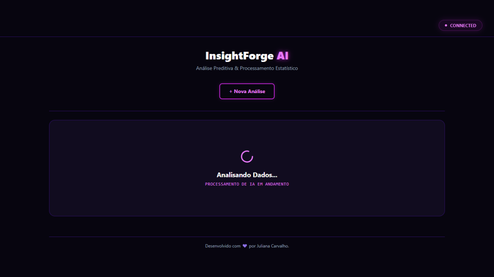
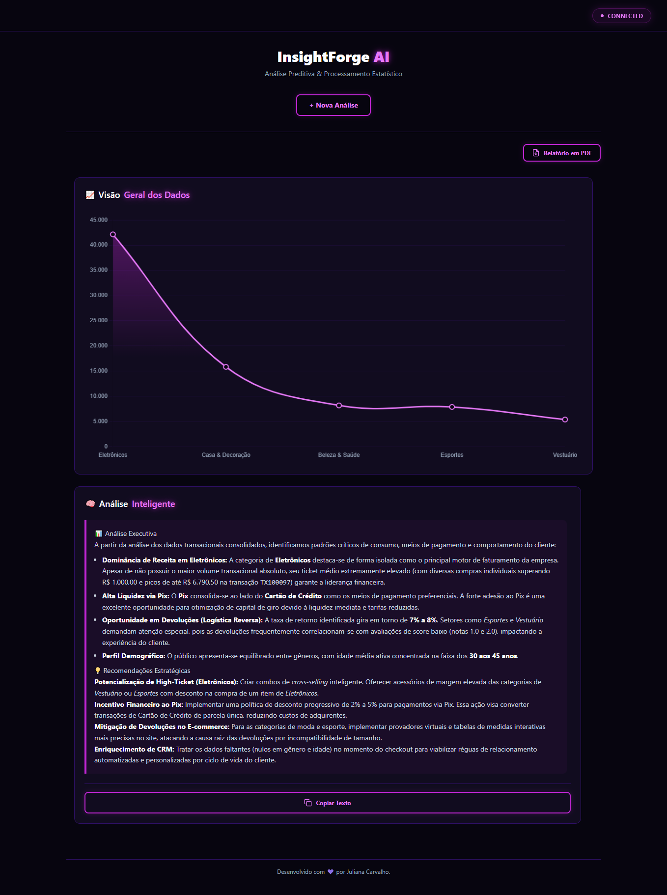

# 📊 InsightForgeAI

O **InsightForgeAI** é uma aplicação Full Stack para análise inteligente de dados empresariais. A plataforma permite realizar auditoria e limpeza de arquivos CSV, gerar dashboards interativos e produzir relatórios estratégicos utilizando Inteligência Artificial através da API do **Google Gemini**.

---

## 📺 Demonstração em Vídeo

Confira o funcionamento completo da plataforma no vídeo de demonstração:

[Assista ao vídeo de demonstração aqui](https://youtu.be/2zX9ygbbUTw)

---

# 📸 Interface

## Dashboard e Relatório Inteligente



---

## Análise Inteligente



---

# ✨ Funcionalidades

## 📊 Análise Inteligente

Envie um arquivo CSV já limpo para gerar um relatório estratégico utilizando Inteligência Artificial.

---

## 🔍 Limpeza e Auditoria de Dados

Envie um arquivo CSV com inconsistências para que o sistema realize automaticamente:

- Remoção de registros duplicados
- Tratamento de valores nulos
- Padronização de textos
- Conversão de datas
- Correção de valores monetários
- Normalização de categorias
- Conversão de formatos inconsistentes

Após o processamento é possível baixar:

- CSV limpo
- Relatório de auditoria com todas as correções realizadas

> Caso deseje gerar uma análise estratégica após a limpeza, basta enviar o CSV corrigido novamente utilizando a funcionalidade de **Análise Inteligente**.

---

# 🏗️ Arquitetura

O backend foi desenvolvido seguindo os princípios da **Clean Architecture**, separando responsabilidades entre as camadas de domínio, aplicação, infraestrutura e apresentação.

```
backend
├── 1.Domain
├── 2.Application
├── 3.Infrastructure
└── 4.Presentation
```

---

# 🛠️ Tecnologias Utilizadas

### Backend

- C#
- .NET 8
- ASP.NET Core
- Entity Framework Core

### Frontend

- React
- TypeScript
- Chart.js

### Banco de Dados

- PostgreSQL

### Inteligência Artificial

- Google Gemini API

---

# 📂 Estrutura do Projeto

```
InsightForgeAI
│
├── assets
├── backend
│   └── src
│       ├── 1.Domain
│       ├── 2.Application
│       ├── 3.Infrastructure
│       └── 4.Presentation
│
└── frontend
    ├── src
    ├── public
    └── package.json
```